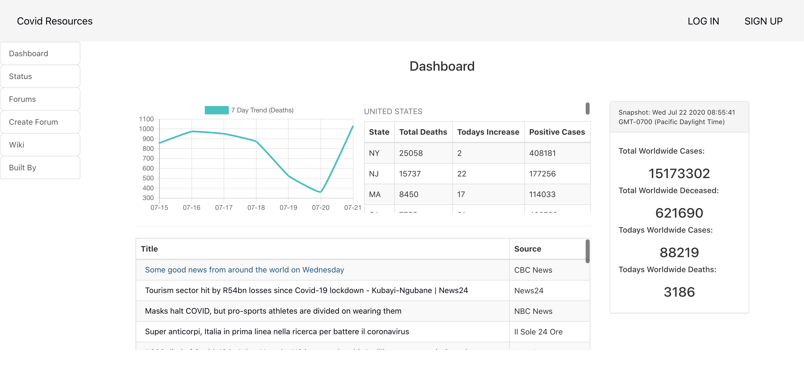

# Covid Resources

This is a COVID-19 tracking app where visitors can view current COVID-19 data, news, and forums discussing COVID related topics.

[Link to App](https://covid-resources.herokuapp.com/)

## ScreenShots

---

### Technologies Used
- MongoDB/Mongoose
- Express
- React
- Node.js
- CSS
- The COVID Tracking Project API
- NewsAPI

---

**Next Steps**
- [ ] Date Toggle
- [ ] Comments
- [ ] Twitter feed